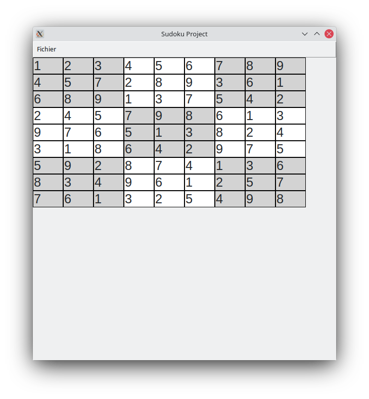

<h3>Sudoku python</h3>

Sudoku 9x9 with graphical interface provided by Tkinter.
 
 

<h3>Algorithm of resolution</h3>
<ul>
    <li>Setting to 0 all empty cells</li>
    <li>Search the next cell who need to be fill in checking if is equal to zero.</li>
    <li>Go through the cell with a loop from 1 to 9 until the number is found and put the number in it</li>
    <li>It restarts the algorithm and repeats it until finds the correct numbers</li>
</ul>

<h3>Resources</h3>
<ul>
    <li><a href="http://www.le-sudoku.fr/le-sudoku/regles">Règles du sudoku</a></li>
    <li><a href="http://newcoder.io/gui/intro/">Helper</a></li>
</ul>
